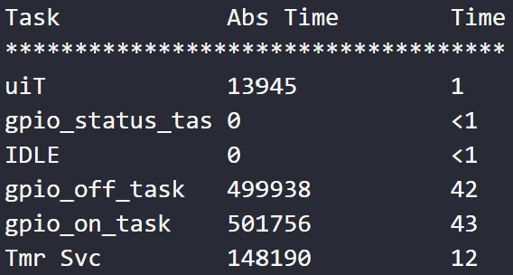
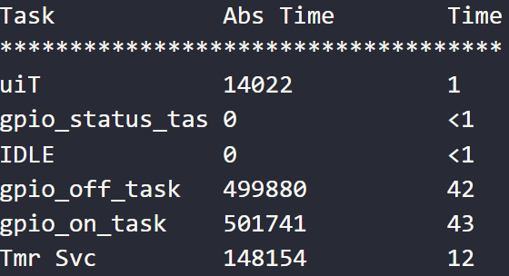

# ECNG3006: Lab 2
This repository consists of three projects based off the example from the espressif ESP8266_RTOS_SDK (https://github.com/espressif/ESP8266_RTOS_SDK). The 'gpio' example was used to conduct the required exercises.

# Question 3

### System Performance: No Processor Sleep

### System Performance: Processor Sleep

Based on the runtime statistics shown it can be seen that the implementation of the processor sleep does not meaningfully impact the system performance. It can however impact the system efficiency, as it reduces the power consumption.