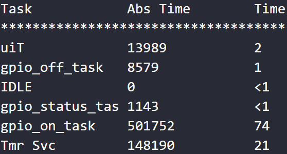
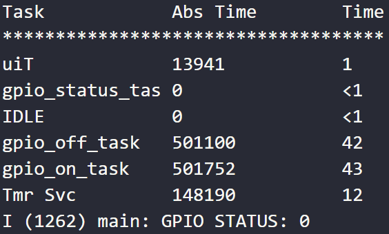
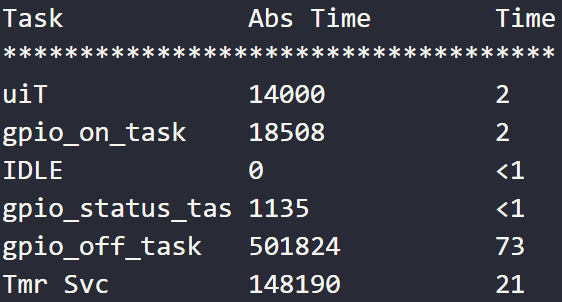
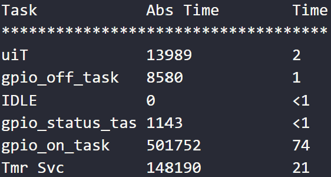
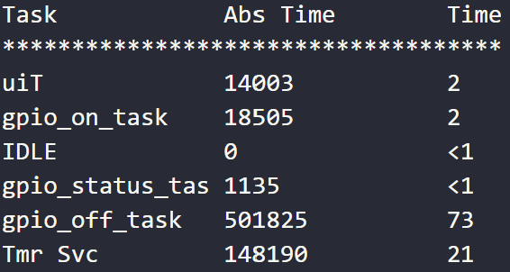

# ECNG3006: Lab 2
This repository consists of three projects based off the example from the espressif ESP8266_RTOS_SDK (https://github.com/espressif/ESP8266_RTOS_SDK). The 'gpio' example was used to conduct the required exercises.

# Question 2
To compare the differences in the performance based on varying task priorities, the following criteria can be used:
Priority Inversion: Higher priority tasks are preempted by lower priority tasks?
Utilisation: Sufficient CPU time for all tasks to be executed?
Feasibility: All tasks meet their respected deadlines?
Jitter: Consistent timing of successive tasks?

### Priority Inheritance
In the case whereby a high-priority task blocks a lower-priority tasks which holds the mutex, the priority of the task holding the mutex is temporarily raised such that it is the same as the blocking task. 

There are 3 tasks, therefore there exists 3! (6) combinations of possible task orders.

### Task1 > Task2 > Task3

### Task1 > Task3 > Task2 

### Task2 > Task1 > Task3

### Task2 > Task3 > Task1

### Task3 > Task1 > Task2

### Task3 > Task2 > Task1

