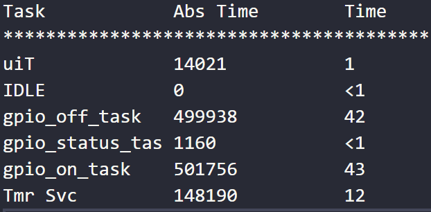

# ECNG3006: Lab 2
This repository consists of three projects based off the example from the espressif ESP8266_RTOS_SDK (https://github.com/espressif/ESP8266_RTOS_SDK). The 'gpio' example was used to conduct the required exercises.

# Question 2
To compare the differences in the performance based on varying task priorities, the following criteria can be used:
Priority Inversion: Higher priority tasks are preempted by lower priority tasks?
Utilisation: Sufficient CPU time for all tasks to be executed?
Feasibility: All tasks meet their respected deadlines?
Jitter: Consistent timing of successive tasks?

### Round-Robin
For round-robin scheduling, each tasks is assigned the same priority. Therefore, tasks are executed on a "first-come, first-served" basis. Each process is executed in a cyclic manner. Each task is allowed to run for a specified amount of time called a quantumn. If the task is not finished by the end of the assigned time, the task is preempted by the next queued task, and is moved to the back of the queue.
\
\

\
\